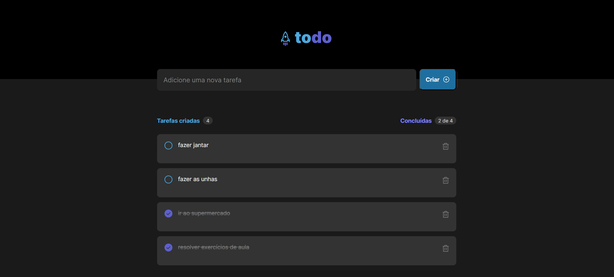

# To Do List - Aplicação Frontend

Este projeto é uma simples aplicação de uma lista de tarefas online. A aplicação foi desenvolvida usando **React, Typescript e React Query**.

<h1 align="center">
    
</h1>

#Como executar o projeto
## 💻 Requisitos

Antes de iniciar, você deve ter o Node.js e o NPM instalados em sua máquina.

## Instalando

Você deve clonar o projeto em sua máquina. Sendo assim, você deve realizar o seguinte comando em seu terminal;

```bash
# clonar repositório
git clone: [https://github.com/MilenaRizzi/frontend-todo-list]

# entrar na pasta todo-list
cd todo-list

# instalar dependências
npm instal

# executar o projeto
npm run dev
```

## Créditos:
- O frontend do projeto é advindo de uma desafio do curso Trilha React da plataforma Rocketseat. Para praticar ainda mais os meu conhecimentos, realizei a construção de uma backend em Java - Spring Boot que permite a persistência das tarefas em um banco de dados Postgres. 

## 🫂 Integração com Backend

Para realizar a integração com o Backend, você pode clonar o projeto e rodar localmente
👉 [Link do repositório](https://github.com/MilenaRizzi/backend-todo-list)

# Autora
Milena Clara Ribeiro Rizzi


